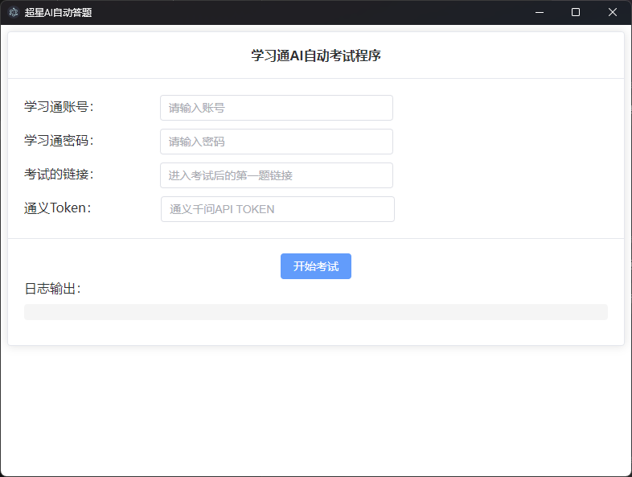

# chaoxingStudy-exam
超星学习通ai自动考试

# 注意！！！！！
# 本项目仅供娱乐 切勿用于考试舞弊等行为 所有使用本程序导致的后果皆由使用者自行承担 本项目不得用于违法违规用途

# 直接使用（推荐）
从release下载打包好的程序，运行exe文件即可，已支持图形化界面 

 

Ps:AI对接通义千问，需自行申请API https://dashscope.console.aliyun.com/

# 手动运行并调用ollama
1.从git下载后，运行main.py 安装环境：pip install dashscope selenium==4.5.0 requests，将chrome 
2.填写你的超星账号密码 
3.填写考试网址（浏览器登录账号，点击开始考试，复制考试第一题的链接即可） 
4.选择ai作答来源ollama 或 通义千问 
通义千问Token获取：https://dashscope.console.aliyun.com/ 
ollama对接：自行修改58：66行代码 

## 注：本项目目前只支单选 多选 判断 的作答
